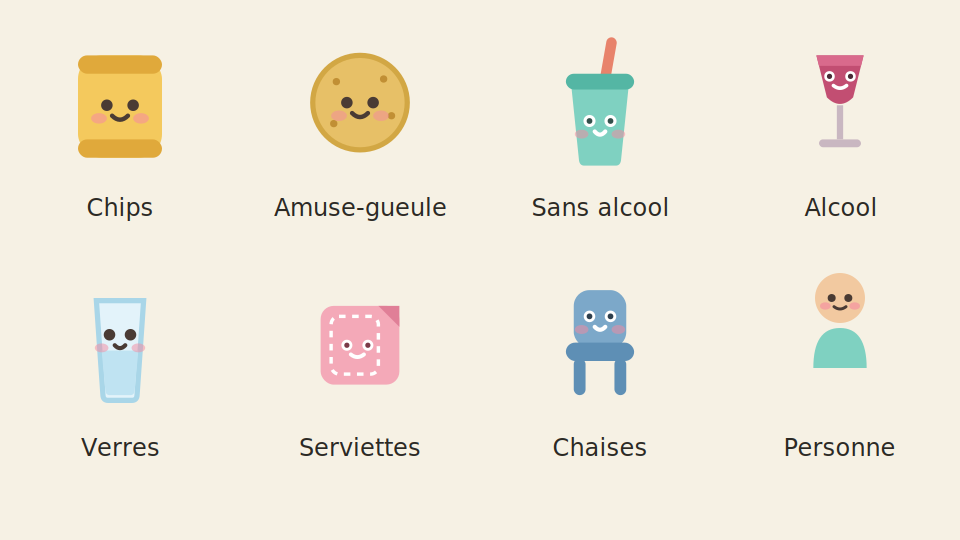

# Pique-nique — auberge espagnole

Application web de coordination de pique-nique en auberge espagnole : inscription par icônes kawaii, menu commun par catégorie, gestion du matériel par tête, grille de présence et vue chevauchements.



**En ligne** : https://nmulongo-sys.github.io/auberge-espagnole/ — pleinement partagé : la liste est synchronisée en direct entre tous les participants via Supabase.  
**Statut** : révision 2026-07-08 (b) · fichier unique `pique-nique.html` · stockage partagé Supabase (REST) · deux types d'événement (auberge espagnole / barbecue) · tour guidé de première connexion · aucune dépendance externe hormis la police Fraunces (Google Fonts, avec repli système hors-ligne).

---

## Utilisation

Aucune installation. Ouvrir `pique-nique.html` dans n'importe quel navigateur moderne (mobile ou desktop). L'app est organisée en trois onglets :

| Onglet | Public | Ce qu'on y fait |
|---|---|---|
| **Participer** | Participants | Inscription à icônes kawaii : prénom, nombre de personnes, ce qu'on apporte (7 items cliquables), horaires en repli |
| **Récapitulatif** | Tous | Menu commun par catégorie, couverture matériel, grille de présence avec vue chevauchements |
| **Pilotage** | Organisateur | Type d'événement (auberge espagnole / barbecue), configuration, gestion des participants, export/import JSON, relance du guide |

Un **guide participants** autonome est fourni séparément : `mode-emploi-auberge-espagnole.html`.

---

## Déploiement

Hébergement statique (GitHub Pages) : le dépôt contient l'app (`pique-nique.html`) et une redirection (`index.html`). Aucun serveur applicatif : le stockage partagé est assuré par une table Supabase interrogée en REST directement depuis le navigateur.

Côté Supabase (déjà en place, à refaire uniquement en cas de nouveau projet) :

- table `pn_state` : une ligne unique `id=1` portant `data` (jsonb, l'état complet de l'app) et `version` (bigint, verrouillage optimiste) ;
- RLS activée : la clé publique (*publishable*) autorise `SELECT` et `UPDATE` sur cette ligne, mais ni `INSERT` ni `DELETE` — la liste ne peut être ni supprimée ni dupliquée depuis le client ;
- l'URL du projet et la clé publique sont inscrites en tête du bloc stockage de `pique-nique.html` (constantes `SB_URL` / `SB_KEY`). Cette clé est publique par conception (même modèle que « Vacances entre nous »).

Le pied de page de l'app affiche le mode de stockage en temps réel (🟢 Supabase partagé / 🟡 hors ligne, données locales).

---

## Architecture & conventions

### Structure du fichier unique (`pique-nique.html`)

```
<head>         Polices + palette CSS + tous les styles (~ 200 lignes)
<body>         HTML des trois pages (#page-participer, #page-recap, #page-pilotage)
               + dialog .copybox (export WhatsApp)
<script>       JS en ordre logique :
               1. Stockage (store)
               2. Constantes (catégories, SIMPLE_ITEMS, SVG kawaii)
               3. État (blankState, normalizeState, mutate)
               4. Temps (toMin, toHHMM, slots, windowOf, overlap)
               5. Rendu inscription (renderItemGrid, renderPeople, renderTimeChips)
               6. Rendu récap (renderMenu, renderConvives, renderGrid)
               7. Rendu pilotage (renderAdmin)
               8. Formulaire avancé (addApportRow, updateRowHint, refreshHints)
               9. Édition / enregistrement (loadForEdit, readForm, saveParticipation)
               10. Export texte WhatsApp (buildGraphicText, copyShare)
               11. Utils (toast, showTab, bindEvent, init)
```

### Modèle de données (`state`)

```js
{
  v: 2,                       // version du schéma
  event: {
    titre, date, lieu,        // textes libres
    debut, fin,               // "HH:MM", créneaux 30 min
    note, attendus            // attendus : nb cible pour la couverture matériel
  },
  people: [
    { id, nom, arrivee, depart, tetes }
    // arrivee / depart : "HH:MM" ou "" (= jusqu'à la fin)
    // tetes : entier ≥ 1 (toi compris)
  ],
  items: [
    { id, personId, categorie, plat, qty }
    // qty : entier > 0 ou null (non quantifié)
    // categorie : valeur de CAT_FOOD ou CAT_MAT
  ]
}
```

### Couche de stockage — Supabase avec verrouillage optimiste

```
1. Supabase (table pn_state, ligne unique id=1)   → partagé, source de vérité
2. localStorage                                    → cache de lecture + repli hors ligne
```

- `sbGet()` lit `data` + `version` ; `sbVersion` mémorise la version lue.
- `sbSet(v, expectedVersion)` écrit **conditionnellement** : `PATCH …&version=eq.N` avec `version = N+1`. Si quelqu'un a écrit entre-temps, la condition ne matche plus, la réponse est vide et l'écriture est considérée en conflit.
- `mutate(fn)` est la seule fonction qui écrit l'état : boucle de rejeu (max 6 tentatives) — relire l'état frais, appliquer `fn`, tenter l'écriture conditionnelle, recommencer en cas de conflit. Deux inscriptions simultanées ne peuvent donc plus s'écraser : la seconde est rejouée sur l'état incluant la première.
- Hors ligne : sauvegarde `localStorage` seulement, avec toast d'avertissement explicite. Le polling (6 s, suspendu quand l'onglet est masqué) resynchronise au retour de la connexion.
- `sbOk` (null / true / false) pilote l'indicateur du pied de page.

Clé `localStorage` : `"pique-nique:data"`.

### Catégories

```js
CAT_FOOD  // 10 catégories nourriture + boissons
CAT_MAT   // 8 catégories matériel

PER_PERSON_MAT = ["Verres & gobelets","Assiettes","Couverts","Chaises & sièges"]
// → ratio affiché : total apporté / headcount().effective
// → signalé en rouge si insuffisant

OTHER_ESS_MAT  = ["Sacs poubelle"]
// → signalé absent, sans ratio

ESS_FOOD = ["Plat principal","Salade","Pain & tartinades","Dessert","Boisson sans alcool"]
// → signalé absent dans "À compléter"
```

### Interface à icônes kawaii (onglet Participer)

```js
SIMPLE_ITEMS   // 7 items fixes : chips, amuse, soft, alc, verres, serv, chaises
               // chaque item porte : key, emoji (repli), label, categorie, plat

SIMPLE_LINES   // disposition en 3 lignes : [chips,amuse] / [soft,alc] / [verres,serv,chaises]

SIMPLE_SVG     // 7 SVG inline kawaii (64×64 px, visage + joues roses)
               // rendu identique sur tous appareils, hors-ligne

PERSON_SVG     // mini-personnage kawaii (24×32 px) répété N fois = "vous venez à N"
PLUS_SVG       // bouton "5+" (disque jaune avec croix)

counts         // { key: n } — état local du formulaire, n = nombre de taps
```

Un tap sur une icône incrémente `counts[key]`. Le badge `×N` et le bouton `−` apparaissent à partir de `n ≥ 1`. La conversion vers `state.items` se fait à l'enregistrement via `readForm()`.

### Types d'événement

```js
EVENT_TYPES = {
  auberge: { label, titreDefaut, items: ITEMS_AUBERGE (7), lines: 3 lignes },
  bbq:     { label, titreDefaut, items: ITEMS_BBQ (12),    lines: 4 lignes }
}
state.event.type   // "auberge" | "bbq" — partagé : choisi en Pilotage, appliqué chez tous
evType()           // accesseur du type courant (repli "auberge")
```

- Le sélecteur `#evtype` (Pilotage) écrit `event.type` via `mutate()` ; le polling propage le
  changement à tous les participants (la grille d'icônes est re-rendue par `renderAll()`).
- Si le titre est encore le titre par défaut de l'ancien type, il bascule vers celui du nouveau.
- Items barbecue : saucisses, merguez, chipolatas, hamburgers (→ Plat principal), baguettes
  (→ Pain & tartinades), sauces (→ Autre nourriture), bières, vin (→ Boisson alcoolisée),
  \+ soft/verres/serviettes/chaises repris du jeu commun. Huit nouveaux SVG kawaii dans `SIMPLE_SVG`.
- Les catégories, l'onglet Récapitulatif et la logique « À prévoir » sont communs aux deux types.

### Tour guidé de première connexion

- `<dialog id="tourDlg">` : 4 étapes (bienvenue → participer → récapitulatif → c'est parti),
  points de progression, boutons Passer / Suivant.
- Ouverture automatique si la clé `localStorage` `"pique-nique:tour-vu"` est absente ;
  posée à la fermeture. Relance possible via « 🧭 Revoir le guide » (Pilotage).

### Grille de présence

- `windowOf(p)` → `[debut_min, fin_min]` (la fin de l'event si `p.depart` vide)
- `cellsList()` → tableau des débuts de tranches de 30 min (sans la dernière)
- `overlap(p1,p2)` → `[start,end]` ou `null`
- Classe CSS `.ov` = chevauchement avec la personne focus ; `.dim` = pas de chevauchement ; `.focus` = personne sélectionnée

### Calcul des convives

```
headcount().effective = Math.max(attendusSaisi, somme_des_tetes)
```
— plancher : on ne peut jamais attendre moins que les inscrits confirmés.

---

## Journal de développement

### 2026-07-08 (b) — Types d'événement + tour guidé
- **Type d'événement partagé** (`state.event.type`, sélecteur en Pilotage) : « Auberge espagnole » (7 icônes existantes) ou « Barbecue » (12 icônes : saucisses, merguez, chipolatas, hamburgers, baguettes, sauces, bières, vin + soft/verres/serviettes/chaises). Le choix de l'organisateur change la grille d'inscription chez tous les participants via le polling.
- Huit nouveaux SVG kawaii dessinés dans le style existant (64×64, pastel, visage + joues roses).
- Bascule automatique du titre par défaut si l'organisateur ne l'avait pas personnalisé.
- **Tour guidé de première connexion** : dialog 4 étapes, ouverture automatique (drapeau `localStorage` `pique-nique:tour-vu`), bouton « 🧭 Revoir le guide » en Pilotage.
- Test de fumée jsdom : 15 vérifications (tour, bascule BBQ, inscription avec les nouveaux items, catégorisation).

### 2026-07-08 — Migration Supabase + GitHub Pages
- Remplacement complet du backend PHP (`api.php` + `data.json` sur InfinityFree) par une table Supabase `pn_state` (ligne unique jsonb) interrogée en REST depuis le navigateur — `api.php` supprimé du dépôt.
- **Verrouillage optimiste réel** : colonne `version`, écriture conditionnelle `PATCH …&version=eq.N`, boucle de rejeu dans `mutate()` (max 6 tentatives). L'ancienne fenêtre d'écrasement entre le GET et le POST est éliminée.
- RLS : `SELECT`/`UPDATE` publics sur la ligne unique, `INSERT`/`DELETE` refusés à la clé publique (vérifié par tests curl).
- Repli hors ligne : cache `localStorage` en lecture, toast d'avertissement en écriture locale, resynchronisation au retour de connexion ; polling suspendu quand l'onglet est masqué.
- Suppression de la cascade 4 niveaux (Claude shared / PHP / localStorage / mémoire) ; le déploiement GitHub Pages devient le mode nominal pleinement partagé.

### 2026-07-02 — Version initiale documentée

- Conception et développement complets sur cette session de conversation.
- Trois onglets : **Participer** (inscription), **Récapitulatif** (menu + grille), **Pilotage** (config + admin).
- Couche de stockage 4 niveaux : Claude shared → `api.php` → localStorage → mémoire.
- `api.php` avec lecture/écriture atomique (`LOCK_EX`) ; instructions InfinityFree intégrées (création manuelle de `data.json`, chmod 666).
- Interface d'inscription à icônes kawaii : 7 SVG inline (chips, amuse-gueule, boisson sans alcool, boisson alcoolisée, verres, serviettes, chaises), dessinés à la main (64×64 px, style pastel, visage + joues roses).
- Compteur de personnes : miniature kawaii `PERSON_SVG` répétée 1 à 4 fois + bouton `5+` incrémental.
- Champ « tu viens à combien ? » : `tetes` par personne, headcount = `max(attendus, Σtetes)`.
- Couverture matériel par tête : ratio `apporté / effective` affiché en vert/rouge pour `PER_PERSON_MAT`.
- Grille de présence avec sélecteur de chevauchements (overlap calculé sur `[arrivee, depart]`).
- Horaires d'arrivée et départ en repli (▾) dans l'onglet Participer pour ne pas surcharger l'interface non-technophile.
- Export WhatsApp texte enrichi (emojis par catégorie, totaux matériel, section ⚠ manques).
- Modification d'une participation : rechargement du formulaire depuis l'état, `counts` reconstruits depuis `state.items`, autres items en formulaire avancé.
- Guide participants autonome fourni séparément : `mode-emploi-auberge-espagnole.html`.
- Polling toutes les 6 s (mode PHP ou Claude) pour synchroniser plusieurs contributeurs simultanés.

---

## Licence

Code produit en collaboration avec Claude (Anthropic). Tous droits réservés — usage personnel. Libre de réutilisation pour tout usage non commercial avec mention de l'auteur original.
